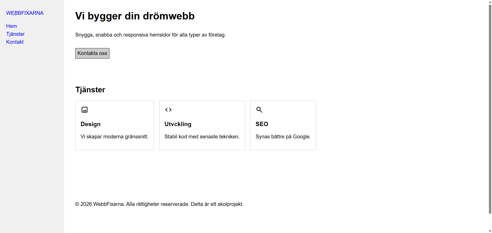

# Flexbox prov

Du får 2 bilder som du ska omvandla till en färdig html layout.
Du får även en html fil med strukturen skriven med semantiska element.

Gör en fork av detta repo så att du har en kopia av materialet på ditt konto.
Klona sedan din fork till din dator.

## Arbetsgång

För varje steg så dokumenterar du dina ändringar i en eller flera commits. Du skriver och förklara vad du gjort i [dokumentation.md](./dokumentation.md).

Gör en eller flera commits med ändringar per steg! Minst en commit ska göras för varje steg.

**Innan du kör igång så går du in på Extensions i VSCode och väljer att disabla GitHub Copilot.**

### Steg 1 - flexbox

Nu ska du koda css för att återskapa sidan. Om du behöver ändra på html-strukturen så gör det, men då ska du också dokumentera varför och vad syftet är.

Du behöver inte använda färg eller bilder, men det kan hjälpa att du sätter en border på element eller en bakgrundsfärg för att göra layouten tydligare.

```css
.border { border: 1px solid black; }
.bg { background-color: grey; }
```

### Krav
* Korrekt HTML-struktur, du kan validera med [validator.nu](https://validator.nu/)
* Använda flexbox för att återskapa layouten
* Använda semantiska taggar

Du kommer att behöva använda en media query för att hantera övergången mellan layouterna, gör det på 768px.

Du skriver en sådan media query i din css så här (testkör den genom att minska storleken på webbläsarfönstret):

```css
@media (max-width: 768px) {
    /* CSS som gäller när skärmen är 768px eller mindre */
    .card {
        border-color: red;
    }
}
```

Kom ihåg att html är innehåll och struktur, css är utseendet.

Var noga med strukturen på dina dokument. Koden ska vara konsekvent, lättläst och ha korrekta indrag. Döp dina css-klasser för att representera vad det är och gör, inte efter hur de ser ut.

`.button-primary {}` inte `.redButton {}`

## Desktop

En vanlig 16:9 aspect ratio  (720, 1080).

* Header: Detta är en sidebar med företagsnamnet överst och sedan följer menyvalen. Headern ska vara lika hög som sidan.
* Hero-sektion: Hela innehållet (rubrik, text och knapp) är vänsterställt. Använd gärna flex för detta. Länken ska se ut som en CTA-knapp.
* Tjänstekort: De tre korten ("Design", "Utveckling", "SEO") ligger bredvid varandra i en horisontell rad med ett jämnt mellanrum (gap).
* Footer: Sidfoten är längst ner(beroende på innehållets storlek).



## Mobil
En stående layout (då blir den ungefär 9:16 i aspect ratio).

* Header: Logotypen och menyalternativen är nu placerade ovanför allt innehåll. 
* Hero-sektion: Innehållet i hero-sektionen är fortfarande vänsterställt. Du kan göra knappen lika bred som sidan.
* Tjänstekort: De tre korten (Design, Utveckling, SEO) är nu staplade i en kolumn, ett ovanför det andra, för att passa den smalare skärmen.
* Footer: Sidfoten är fortfarande längst ner.

